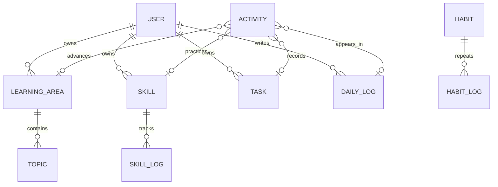

# Personal Life OS

## Cross-platform delivery
The MVP is installable as a Progressive Web App (PWA), so it runs from the same codebase on macOS, Windows and iPhone. This repository is configured for GitHub Pages at `https://wangjerry0930-alt.github.io/personal-life-os/`. On macOS/Windows, open the deployed HTTPS URL in Chrome or Edge and choose “Install app”. On iPhone, open the HTTPS URL in Safari, choose Share → Add to Home Screen. The responsive layout uses touch-friendly controls and `viewport-fit=cover` for iPhone safe areas. Local data is kept in `localStorage` and remains available offline after the app shell has loaded.

For store-distributed native apps later, keep this React UI as the shared frontend and add Capacitor for iOS plus Tauri for macOS/Windows. Native wrappers should provide secure filesystem sync, notifications and account authentication while the domain/store layer stays unchanged.

## Product architecture
Local-first single page MVP with a typed domain model, repository-style persistence, and feature modules. The UI is desktop-first and responsive. `localStorage` is the development data layer; it can be swapped for Supabase/Prisma behind the same store interface.

## Information architecture
Dashboard, Today, Growth (Learning Areas, Skills, Habits, Goals), People, Projects, Knowledge, Journal, Analytics, Search, Settings. Phase 1 implements Dashboard, Today, Learning Areas, Skills, Habits, Goals, Daily Log, Activity and Quick Capture.

## Core schema
`User -> LearningArea -> Topic`, `User -> Skill -> SkillLog`, `User -> Goal`, `User -> Habit -> HabitLog`, `User -> Task`, `User -> DailyLog`, and the cross-module `Activity`. Activity references task, skill, learning area, project, people, resource and daily log IDs, so one event is recorded once and reused everywhere. Future entities: Project, Person, Interaction, ImportantDate, Gift, KnowledgeItem, Resource, Review, Notification, Tag/EntityTag, AIExtraction.

## ER sketch

## Folder structure
`src/domain` types and seed data; `src/store` persistence; `src/components` reusable primitives; `src/pages` feature screens; `src/App.tsx` shell and routing.

## AI / knowledge / privacy
AI lives behind `services/ai` with confirm-before-save extraction. Daily Knowledge runs Fetch -> Normalize -> Deduplicate -> Rank -> Summarize -> Personalize -> Save. AI access is opt-in per data category; MVP stores everything locally and has no public sharing.

## MVP roadmap
Phase 1: typed local-first foundation, dashboard, today, growth, journal, activity, quick capture. Phase 2: people, interactions, projects, relationship tasks. Phase 3: knowledge ingestion. Phase 4: AI capture and reviews. Phase 5: graph, analytics, advanced search, cloud sync.
